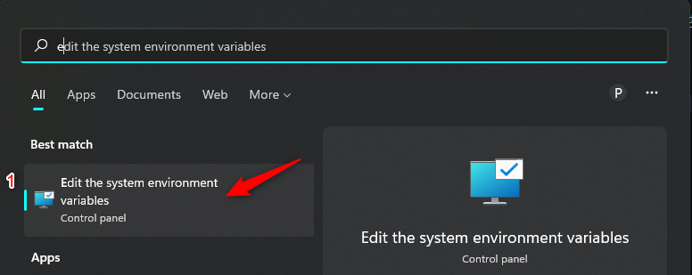
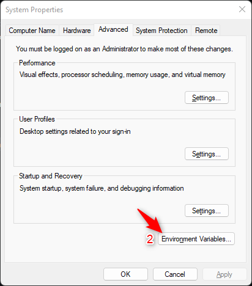
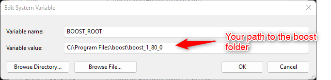
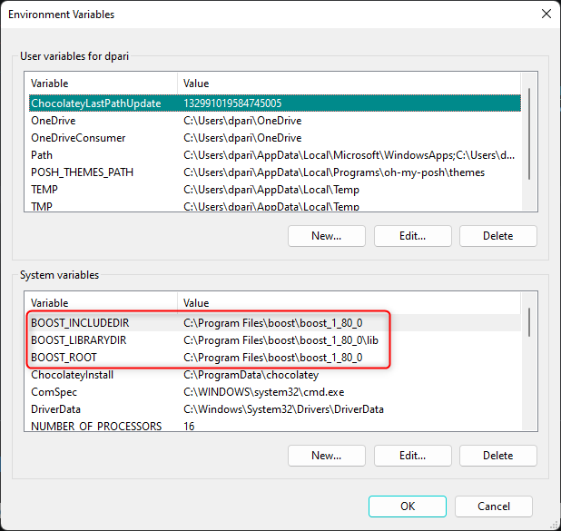
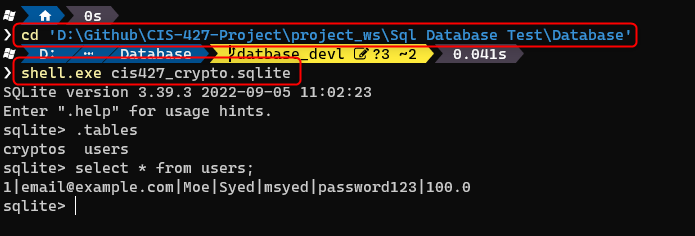

# CIS-427-Project

This repo contains the code for CIS 427 Computer Network class.

## Perquisites:

Before being able to build and debug the code the following libraries needs to be installed by the user.

1) <a href="https://www.boost.org/" target="_blank">Boost C++ libraries</a>
2) <a href="https://www.sqlite.org/download.html" target="_blank">SQLite</a>

### Building Boost Library
 The overall steps to build the boost library can be found  <a href="https://www.boost.org/doc/libs/1_80_0/tools/build/doc/html/index.html" target="_blank">here.</a> There are however additional steps that need to be taken such as creating environment variables which are shown below.

 
## Using the SQLite executable 
In project_ws->SqL Database test -> Database
The idea is to be able to test commands here which are later implemented in the code.

** 1) Open the Powershell and change directory to this folder.

** 2) After than run sqlite3.exe <database file>

